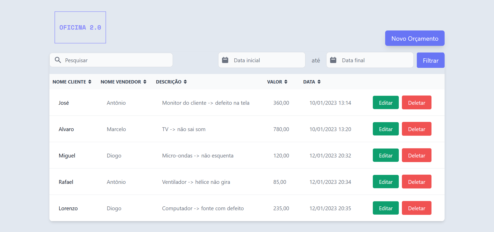

<h1 align="center">🔧 Oficina 2.0 🔧</h1>

Nessa aplicação é possível controlar e manipular de forma eficiente e simples os orçamentos da sua oficina.
A aplicação conta com com filtros para intervalos de datas, ordenação por preços, datas, além das features comuns de um CRUD(Create, Read, Update & Delete) e muito mais.
<br>
Através de um dashboard elegante manter tudo organizado e dentro dos prazos se torna uma tarefa divertida e fácil!

<p align="center">
 
</p>

<br>

<p align="center">

</p>

<br>

<h2 align="center">Tecnologias Usadas</h2>
 <p align="center">
 
 
    
 
 
 
 
</p>

- Back-end: 
  - [`Laravel`](https://laravel.com/) ([`PHP`](https://www.php.net/), `Artisan`, [`Composer`](https://getcomposer.org/))
  - [`Insomnia`](https://insomnia.rest/download) (Testes manuais da Api REST)
  - Banco de Dados [`SQLite`](https://www.sqlite.org/index.html) + [`SQLite DB Browser`](https://sqlitebrowser.org/)
  <br>
- Front-end: 
  - [`Vue.js`](https://vuejs.org/)
  - [`Tailwind`](https://tailwindcss.com/) + [`Flowbite.js`](https://flowbite.com/)
  - [`Day.js`](https://day.js.org/)
  - `Javascript`
  - [`Vite.js`](https://vitejs.dev/)(bundler)
___
### Dificuldades encontradas: 
Durante a instalção, aparentemente a minha máquina (Windows) estava com configurações conflitantes com a criação do projeto no Back-end. Mas depois de estudar os erros, desinstalar e reinstalar algumas depêndencias conflitantes, começou a dar certo. Tive alguns problemas também com o hot-reload do Vite que não estava funcionando. Por último e não menos importante, algumas funcionalidades(DateRangePicker) do Flowbite estavam literalmente sem documentação, e para fazê-las funcionar, tive que procurar em vários repositórios do Github o código fonte delas e a partir daí extrair as funções que eu precisava.
___
# Instalação
Certifique-se de que [Node.js](https://nodejs.org/en/download/) e [PHP](https://www.php.net/downloads.php) estão instalados.
<br>
### Back-end
Instale o [PHP-SQLite](https://www.php.net/manual/en/sqlite3.installation.php):
```
sudo apt install php-sqlite3
```
Obs.: Em caso de erro na instalação e configuração do php-sqlite entre nesse [link](https://stackoverflow.com/questions/8803728/pdo-sqlite-could-not-find-driver-php-file-not-processing)
___
Instale o [Composer](https://getcomposer.org/download/).
<br>
E pronto! Agora basta clonar o projeto:
```
git clone https://github.com/Eric-Catarina/Oficina2.0-CRUD.git
```
Entrar na pasta criada:
```
cd Oficina2.0-CRUD
```
Instalar as dependências PHP:
```
composer install
```
E rodar o servidor:
```
php artisan serve
```
### Front-end
Para ver a aplicação, **abra outro terminal** e entre na pasta do front-end:
```
cd vue-rest-api
```
Instalar os pacotes node:
```
npm install
```
E rodar a aplicação:
```
npm run dev
```
Clique [aqui](http://localhost:3000/orcamento) para ver a aplicação🎆
